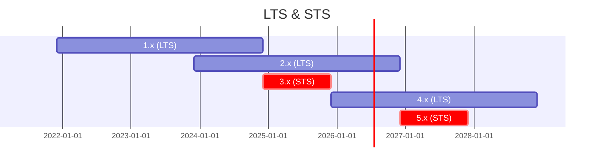

# Welcome to KoliBri

> „The accessible HTML-Standard“

**KoliBri** stands for „Component library for the accessibility“ and was from the
[Informationstechnikzentrum Bund (ITZBund)](https://itzbund.de)
open source released for reuse and further development.

## Vision

Together we make **HTML** accessible using **reusable web components** to ensure **usability** and **accessibility**.

## Mission

The [HTML web standard](https://html.spec.whatwg.org) is itself very “openly” specified in order to be as long-lasting and robust as possible. It therefore often happens that HTML compositions are not easily accessible, semantic and valid.

KoliBri is based directly on the [Web standards](https://www.w3.org/standards/webdesign/) of the [W3C](https://www.w3.org) (framework-agnostic), and is generic Reference implementation of the [WCAG standard](https://www.w3.org/WAI/standards-guidelines/wcag/) and the [BITV](https://www.bitvtest.de/bitv_test.html) for accessibility and implemented as a multi-theming capable presentation layer. There is no technical reference and no data transfer functionality. This means that KoliBri is equally reusable for the realization of static websites as well as dynamic web applications with different corporate designs and style guides and is therefore very interesting for open source.

## Roadmap

| Version | Release type | Release | Zeitraum | End-of-Support |
| --: | :-: | :-: | :-: | :-: | 
| 1.x | LTS | Dez 2021 | 3y | Dez 2024 |
| 2.x | LTS | Dez 2023 | 3y |  Dez 2026 |
| 3.x | STS | Dez 2024 | 1y |  Dez 2025 |
| 4.x | LTS | Dez 2025 | 3y |  Dez 2028 |
| 5.0 | STS | Dez 2026 | 1y |  Dez 2027 |

## Collaboration and cooperation

The **focus** of KoliBri is on **small** (atomic), very **flexible** and highly **reusable** HTML compositions (e.g. buttons). We offer an accessible, semantic and valid standard implementation of such components that can be reused for any higher-level HTML structure or component (molecule, organism or template).
These atomic components are where we should **collaborate** and **cooperate** to combine our skills and knowledge. The synergy effects on the basic components allow you to focus more on subject-specific content.

Let's make KoliBri **better** and **more colorful** together!

> Continue [to **Documentation**](https://public-ui.github.io)…

## Let's go

- [Get Started](https://public-ui.github.io/en/docs/get-started/first-steps)
- [Contributing](./CONTRIBUTING.md)
- [Code of Conduct](./CODE_OF_CONDUCT.md)
- [Sicherheit](./docs/SECURITY.md)
